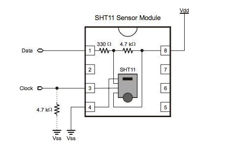
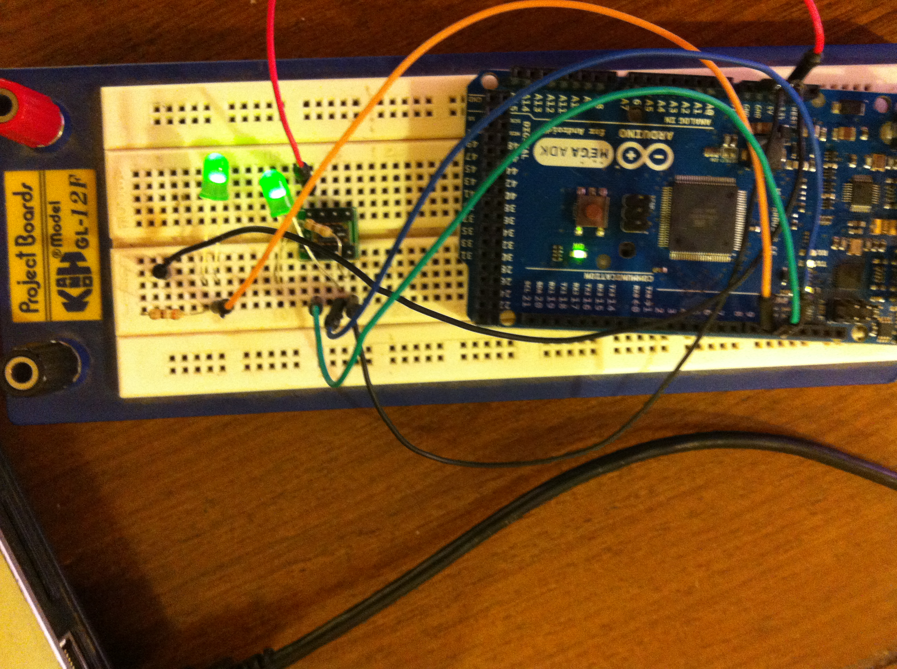
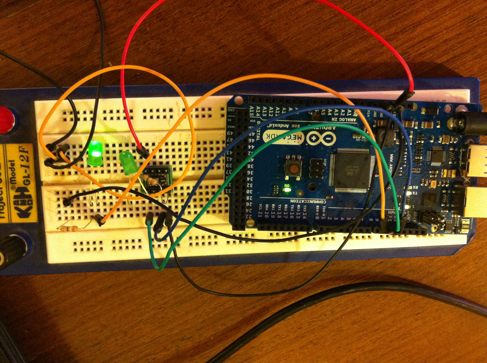

# Arduino - Processing Experiment with SHT11 Module

This was a small experiment made at November 29th 2012.

El proyecto busca utilizar el sensor de temperatura y humedad _SHT11_ (_SHT11_ desde ahora) para la creación de un prototipo que podría ser usado en diversas aplicaciones y situaciones. Una de ellas, por ejemplo, sería el monitoreo de variables ambientales en una estación meteorológica, un frigorífico,  o toma de datos en el ámbito minero. Para ésto se ha optado por la plataforma Arduino, la cual tiene gran popularidad y es de bajo costo.

## Implementos

1.  Arduino Mega ADK
2.  2 Led
3.  2 Resistencias 
4.  Cables para conexión de los componentes
5.  Protoboard
6.  Sensor de Temperatura/Humedad SHT11

## https://www.arduino.cc/[Arduino]

Lo que hace es obtener los datos del componente SHT11 y según una condición específica (temperatura en cierto rango), activa la salida del PWM a distintas frecuencias. Éste comportamiento puede ser aprovechado para activar un motor, reproducir un sonido u otro tipo de señal. Para éste prototipo se ha utilizado un simple led para indicar que la condición pre-establecida se ha cumplido.

## https://processing.org/[Processing]

Se ha creado un pequeño proyecto en el entorno processing para graficar las lecturas de temperatura. Presenta un cuadrado que cambia su tamaño y color dependiendo de las variables ambientales que entrega arduino. Además genera un archivo separado por comas, con la fecha y hora junto a las lecturas. Ésto es útil si se deseara crear un servidor que permita el acceso remoto a los datos.

## Conexión

Para la conexión del sensor _SHT11_ con Arduino se siguió el siguiente esquema:

A continuación se presenta la tabla de conexiones entre el SHT11 y Arduino.

[width="100%"]
|=======
|PIN SHT11 | PIN ARDUINO
| 1 | 10
| 3 | 11
| 4 | GND
| 8 | 5v
|=======

Se ha conectado un led en el Pin 9 de Arduino para mostrar la salida de PWM. Adicionalmente se ha conectado un led a la salida de Clock (Pin 3) del SHT11 para visualizar cada vez que realiza cada lectura. Las resistencias son simplemente para el correcto funcionamiento de los leds.

++++
Made with <i class="fa fa-heart">&#9829;</i> by <a href="http://ninjas.cl" target="_blank">Ninjas.cl</a>.
++++